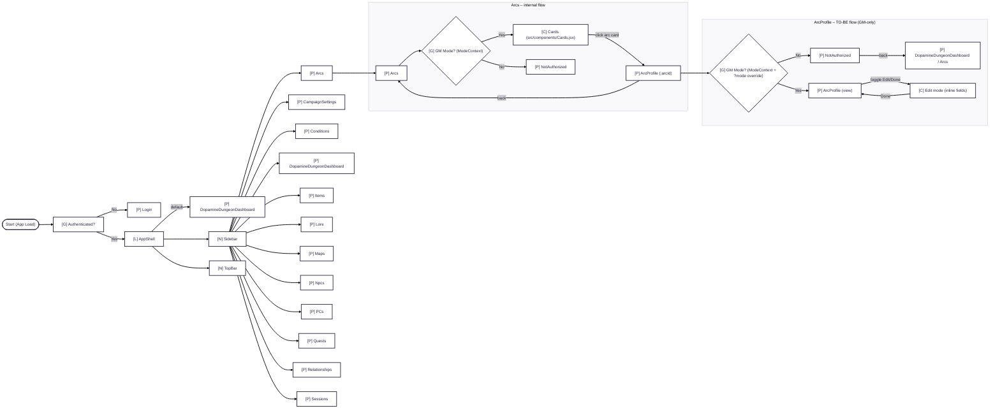

# Dopamine Dungeon 🐉✨

Dopamine Dungeon is a **campaign management app** for tabletop RPGs (D&D-first), designed to keep a whole campaign’s “living brain” in one place:
- NPCs, PCs, Items, Lore, Maps, Sessions
- GM-only vs Player views
- Campaign-scoped data + global navigation
- Cozy UI, fast lookup, and structured flows

**Live app:** https://dopamine-dungeon-final.vercel.app

---

## What’s in this repo

- **React + Vite** frontend
- Modular pages + profiles (e.g. `Items → ItemProfile`, `Sessions → SessionProfile`)
- Context-driven gating:
  - authentication
  - GM/Player mode
  - campaign selection
  - visibility rules
  - assignment rules (PCs)

---

## System navigation diagram (Master Flow)

> This is the **TO-BE contract** for how navigation + gating should work.
> It’s used to compare AS-IS vs TO-BE and derive user stories / refactors.

  %% (rest of Master Flow is maintained in `docs/masterflow.md`)

Full diagram (with all embedded flows): `docs/masterflow.md`

---

## Architecture & flow docs

All system diagrams live in docs/ and are authored in Mermaid (designed in MermaidChart, stored as Markdown).

👉 Diagram index: `docs/SYSTEMSDIAGRAMS.md`

---

## Dev setup
`pnpm install`
`pnpm dev`

Build: 
`pnpm build`
`pnpm preview`

---

## Conventions (diagram nodes)
- `[P]` – Page (from `src/pages`)
- `[L]` – Layout / Shell (persistent UI structure)
- `[N]` – Navigation component (Sidebar, TopBar, etc.)
- `[C]` – UI component
- `[CTX]` – Context / state container (React Context)
- `[G]` – Gate / Decision (auth, mode, permissions)