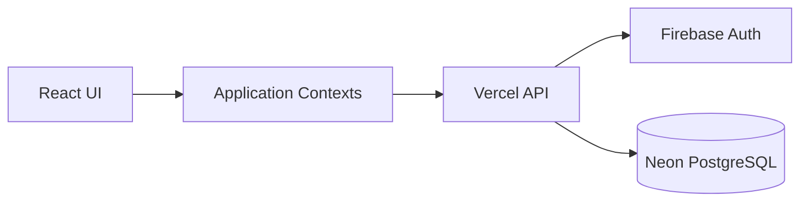

# System Overview

## Purpose

Dopamine Dungeon is a campaign-management application for game masters
and players.

## Core hierarchy

Workspace
└── Campaign
    ├── Members
    ├── Sessions
    ├── Items
    ├── NPCs
    ├── Locations
    ├── Lore
    ├── Quests
    └── Relationships

## Identity and authorization

- Firebase Authentication establishes user identity.
- Application data is stored in Neon PostgreSQL.
- Workspace membership and campaign membership determine access.
- GM/player mode affects visibility and available actions.
- Client-side hiding is not sufficient authorization.

## Application layers


# Environments

## Development

- Local development
- Development Firebase project
- Development Neon database
- Feature branches and dev

## Production

- Vercel production deployment from main
- Production Firebase project
- Production Neon database

Never assume development and production credentials are interchangeable.

Cross-cutting rules

- Every campaign-owned record must be scoped to a campaign.
- Every API endpoint must validate authenticated identity.
- Authorization must be enforced server-side.
- Player-hidden information must not be returned merely because the UI hides it.
- Database changes require an explicit migration.

---

We would later refine this from the actual repository. This is a seed, not holy scripture.

---

# File 4: Architecture decisions

An ADR records **why**, not merely what.

`docs/architecture/adr/0001-neon-as-primary-database.md`:

```md
# ADR 0001: Neon PostgreSQL as the Primary Application Database

Status: Accepted
Date: 2026-04

## Context

Dopamine Dungeon originally relied heavily on Firebase.
The product requires relational structures including workspaces,
campaigns, memberships, cross-linked entities, reporting, and
transactionally consistent operations.

## Decision

Use Neon PostgreSQL as the primary application data store,
accessed through Drizzle ORM.

Firebase remains responsible for authentication unless superseded
by a separate approved decision.

## Consequences

Positive:

- Relational constraints and joins
- Better support for reporting
- Explicit migrations
- Stronger transactional capabilities

Negative:

- Additional backend and migration complexity
- Authentication identity must be mapped to relational users
- Development and production database environments must be managed safely

## Rejected alternatives

### Continue using Firestore as the primary database

Rejected because increasingly relational domain models would require
denormalization, duplicated state, and more difficult cross-entity queries.

## Revisit when

- Neon becomes operationally unsuitable
- Authentication and database ownership are redesigned together
- A documented product requirement materially changes the trade-off