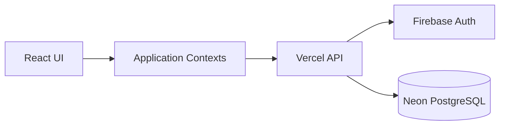

# System Overview

## Purpose

Dopamine Dungeon is a campaign-management application for game masters
and players.

## Core hierarchy

Workspace
└── Campaign
    ├── Members
    ├── Sessions
    ├── Items
    ├── NPCs
    ├── Locations
    ├── Lore
    ├── Quests
    └── PCs
        └── Bag of Holding
    

## Identity and authorization

- Firebase Authentication establishes user identity.
- Application data is stored in Neon PostgreSQL.
- Workspace membership and campaign membership determine access.
- GM/player mode affects visibility and available actions.
- Client-side hiding is not sufficient authorization.

## Application layers

# Environments

## Development

- Local development
- Development Firebase project
- Development Neon database
- Feature branches and dev

## Production

- Vercel production deployment from main
- Production Firebase project
- Production Neon database

Never assume development and production credentials are interchangeable.

Cross-cutting rules

- Every campaign-owned record must be scoped to a campaign.
- Every API endpoint must validate authenticated identity.
- Authorization must be enforced server-side.
- Player-hidden information must not be returned merely because the UI hides it.
- Database changes require an explicit migration.

---