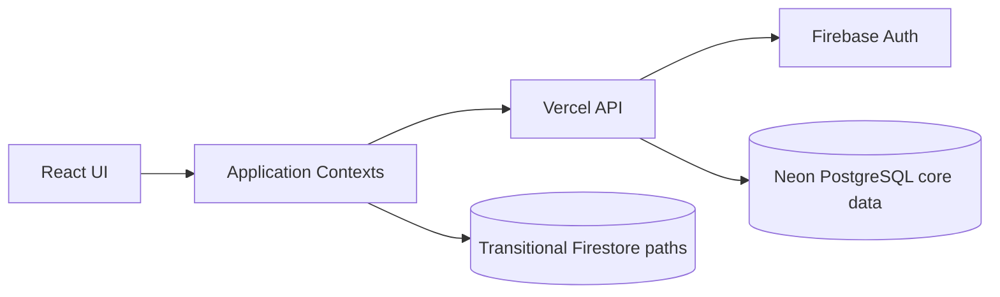

# System Overview

Last updated: 2026-08-24

Dopamine Dungeon is a multi-tenant campaign-management application for game
masters and players. This document is the current high-level architecture and
data-ownership reference. Testing semantics live in
[`docs/operations/TESTING.md`](../operations/TESTING.md); branch and CI policy
lives in [`docs/operations/REPOSITORY_POLICY.md`](../operations/REPOSITORY_POLICY.md).

## Core hierarchy

Workspace
|-- Campaign
    |-- Members
    |-- Sessions
    |-- Items and inventory
    |-- NPCs
    |-- Locations
    |-- Lore
    |-- Quests
    `-- PCs
        `-- Bag of Holding

Typed entity links connect active campaign entities. The retired standalone
Relationships page is not part of the product. Future PC-NPC and NPC-NPC
relationship behavior belongs to cross-linking and Friendship Index work.

## Runtime layers

```mermaid
flowchart LR
    UI[React UI]
    CTX[Application Contexts]
    API[Vercel API]
    AUTH[Firebase Auth]
    CORE[(Neon PostgreSQL core data)]
    TRANS[(Transitional Firestore paths)]

    UI --> CTX
    CTX --> API
    API --> AUTH
    API --> CORE
    CTX --> TRANS
```

The full local application is run with `pnpm vercel dev`, which serves the
Vite frontend and Vercel API functions together. `pnpm dev` is frontend-only
and is not evidence that protected API or persistence workflows work.

## Identity and authentication

- Firebase Authentication establishes the authenticated identity.
- The Firebase UID is mapped to the application user and memberships. Email is
  not used to merge identities.
- Password users must complete email verification before protected server
  access. The server verifies Firebase ID tokens rather than trusting client
  state.
- Authentication tests use the guarded `demo-dopamine-dungeon` emulator setup;
  tests never use production Firebase or campaign data.

## Authorization and visibility

- Workspace membership scopes workspace access.
- Campaign membership scopes campaign access and provides campaign role.
- A GM-capable user may select GM or Player mode. The selected mode is sent to
  relevant API requests using `X-DD-Mode`; capability alone does not grant GM
  visibility.
- Server handlers fail closed to Player visibility when the mode is absent,
  invalid, unreadable, or not an allowed downgrade. Hidden entities,
  relationships, notes, and spoiler fields must not be serialized for Player
  requests.
- Client-side navigation filtering is a usability aid, not an authorization
  boundary. See the permission diagrams and the boundary layer in
  `docs/operations/TESTING.md`.

## Persistence ownership

Neon PostgreSQL, accessed through the Vercel API and Drizzle-backed
repositories, is the primary store for core relational campaign entities:
sessions, items, inventory, NPCs, locations, lore, quests, PCs, and typed
entity links. Campaign and workspace scoping is enforced at the API/data-access
boundary.

Firestore remains on explicitly transitional paths, including workspace
bootstrap, some membership and invitation flows, settings, mail delivery, and
legacy character-assignment/user repositories. No new Firestore application
data writes should be introduced. Do not remove a transitional path until its
replacement and rollback behavior are verified. ADR 0003 records the
transition; the Neon decision is bounded by ADR 0001.

## Environments and repository workflow

- Local development uses local credentials and `pnpm vercel dev`.
- Emulator-backed tests use the demo Firebase project and generated users.
- `dev` is the integration/preview branch. Feature branches target `dev`.
- `main` is the production deployment source. Development and production
  Firebase, Neon, and Vercel environments are separate.
- Optional `release/vX.Y` branches are short-lived stabilization branches.
  Hotfixes branch from `main` and return to `dev` after release validation.
- Agents do not merge PRs, deploy production, alter production data, or change
  remote branch protections. The exact target settings are documented in
  `docs/operations/REPOSITORY_POLICY.md`.

## Cross-cutting rules

- Every campaign-owned record and query is scoped to the active campaign and
  its workspace.
- Every protected API endpoint validates authenticated identity and
  membership server-side.
- Player-hidden information must not be returned merely because the UI hides
  it.
- Schema changes require explicit migrations and rollback or mitigation notes.
- Production secrets and data are never used by local or automated tests.
