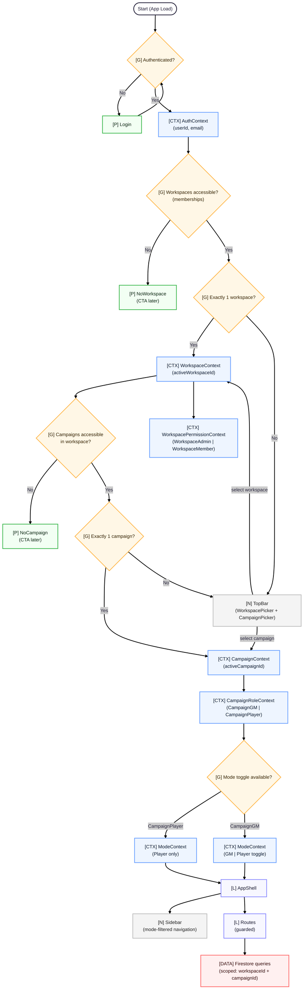
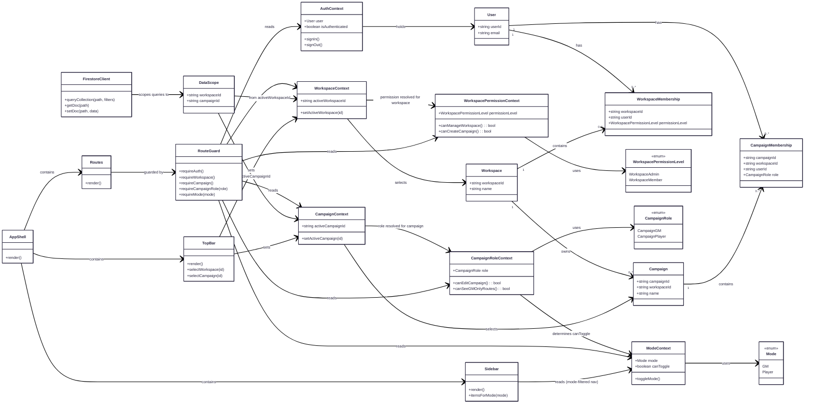

# Flowchart

```mermaid
---
config:
  theme: redux
  layout: dagre
---
flowchart TB
    A0(["Start (App Load)"]) --> A1{"[G] Authenticated?"}
    A1 -- No --> A2["[P] Login"]
    A2 --> A1
    A1 -- Yes --> CTX_AUTH["[CTX] AuthContext</br>(userId, email)"]
    CTX_AUTH --> WS_LIST{"[G] Workspaces accessible?</br>(memberships)"}
    WS_LIST -- No --> WS_NONE["[P] NoWorkspace</br>(CTA later)"]
    WS_LIST -- Yes --> WS_ONE{"[G] Exactly 1 workspace?"}
    WS_ONE -- Yes --> CTX_WS["[CTX] WorkspaceContext</br>(activeWorkspaceId)"]
    WS_ONE -- No --> TOPBAR_PICK["[N] TopBar</br>(WorkspacePicker + CampaignPicker)"]
    TOPBAR_PICK -- select workspace --> CTX_WS
    CTX_WS --> CAMP_LIST{"[G] Campaigns accessible</br>in workspace?"} & CTX_WSPERM["[CTX] WorkspacePermissionContext</br>(WorkspaceAdmin | WorkspaceMember)"]
    CAMP_LIST -- No --> CAMP_NONE["[P] NoCampaign</br>(CTA later)"]
    CAMP_LIST -- Yes --> CAMP_ONE{"[G] Exactly 1 campaign?"}
    CAMP_ONE -- Yes --> CTX_CAMP["[CTX] CampaignContext</br>(activeCampaignId)"]
    CAMP_ONE -- No --> TOPBAR_PICK
    TOPBAR_PICK -- select campaign --> CTX_CAMP
    CTX_CAMP --> CTX_ROLE["[CTX] CampaignRoleContext</br>(CampaignGM | CampaignPlayer)"]
    CTX_ROLE --> MODE_AVAIL{"[G] Mode toggle available?"}
    MODE_AVAIL -- CampaignPlayer --> CTX_MODE_P["[CTX] ModeContext</br>(Player only)"]
    MODE_AVAIL -- CampaignGM --> CTX_MODE_GM["[CTX] ModeContext</br>(GM | Player toggle)"]
    CTX_MODE_P --> SHELL["[L] AppShell"]
    CTX_MODE_GM --> SHELL
    SHELL --> SIDEBAR["[N] Sidebar</br>(mode-filtered navigation)"] & ROUTES["[L] Routes</br>(guarded)"]
    ROUTES --> DATA["[DATA] Firestore queries</br>(scoped: workspaceId + campaignId)"]

     A1:::guard
     A2:::page
     CTX_AUTH:::ctx
     WS_LIST:::guard
     WS_NONE:::page
     WS_ONE:::guard
     CTX_WS:::ctx
     TOPBAR_PICK:::nav
     CAMP_LIST:::guard
     CTX_WSPERM:::ctx
     CAMP_NONE:::page
     CAMP_ONE:::guard
     CTX_CAMP:::ctx
     CTX_ROLE:::ctx
     MODE_AVAIL:::guard
     CTX_MODE_P:::ctx
     CTX_MODE_GM:::ctx
     SHELL:::layout
     SIDEBAR:::nav
     ROUTES:::layout
     DATA:::data
    classDef ctx fill:#eef5ff,stroke:#6aa0ff,color:#0b1b33
    classDef guard fill:#fff7e6,stroke:#ffb84d,color:#3a2500
    classDef page fill:#f2fff3,stroke:#3fb950,color:#0b2a12
    classDef layout fill:#f7f7ff,stroke:#8b8bff,color:#1a1a33
    classDef nav fill:#f4f4f4,stroke:#bdbdbd,color:#222
    classDef data fill:#fff0f0,stroke:#ff6b6b,color:#3a0b0b
```

# Class chart

```mermaid
---
config:
  theme: redux
---
classDiagram
direction LR

%% =========================
%% Core domain-ish types
%% =========================

class User {
  +string userId
  +string email
}

class Workspace {
  +string workspaceId
  +string name
}

class Campaign {
  +string campaignId
  +string workspaceId
  +string name
}

class WorkspaceMembership {
  +string workspaceId
  +string userId
  +WorkspacePermissionLevel permissionLevel
}

class CampaignMembership {
  +string campaignId
  +string workspaceId
  +string userId
  +CampaignRole role
}

class WorkspacePermissionLevel {
  <<enum>>
  WorkspaceAdmin
  WorkspaceMember
}

class CampaignRole {
  <<enum>>
  CampaignGM
  CampaignPlayer
}

class Mode {
  <<enum>>
  GM
  Player
}

%% =========================
%% Contexts (React Context state containers)
%% =========================

class AuthContext {
  +User user
  +boolean isAuthenticated
  +signIn()
  +signOut()
}

class WorkspaceContext {
  +string activeWorkspaceId
  +setActiveWorkspace(id)
}

class WorkspacePermissionContext {
  +WorkspacePermissionLevel permissionLevel
  +canManageWorkspace(): bool
  +canCreateCampaign(): bool
}

class CampaignContext {
  +string activeCampaignId
  +setActiveCampaign(id)
}

class CampaignRoleContext {
  +CampaignRole role
  +canEditCampaign(): bool
  +canSeeGMOnlyRoutes(): bool
}

class ModeContext {
  +Mode mode
  +boolean canToggle
  +toggleMode()
}

%% =========================
%% UI / Routing containers
%% =========================

class AppShell {
  +render()
}

class TopBar {
  +render()
  +selectWorkspace(id)
  +selectCampaign(id)
}

class Sidebar {
  +render()
  +itemsForMode(mode)
}

class Routes {
  +render()
}

class RouteGuard {
  +requireAuth()
  +requireWorkspace()
  +requireCampaign()
  +requireCampaignRole(role)
  +requireMode(mode)
}

%% =========================
%% Data layer / access contract
%% =========================

class FirestoreClient {
  +queryCollection(path, filters)
  +getDoc(path)
  +setDoc(path, data)
}

class DataScope {
  +string workspaceId
  +string campaignId
}

%% =========================
%% Relationships
%% =========================

User "1" --> "0..*" WorkspaceMembership : has
Workspace "1" --> "0..*" WorkspaceMembership : contains
Workspace "1" --> "0..*" Campaign : owns
User "1" --> "0..*" CampaignMembership : has
Campaign "1" --> "0..*" CampaignMembership : contains

AuthContext --> User : holds
WorkspaceContext --> Workspace : selects
CampaignContext --> Campaign : selects

WorkspacePermissionContext --> WorkspacePermissionLevel : uses
CampaignRoleContext --> CampaignRole : uses
ModeContext --> Mode : uses

CampaignRoleContext --> ModeContext : determines canToggle
CampaignContext --> CampaignRoleContext : role resolved for campaign
WorkspaceContext --> WorkspacePermissionContext : permission resolved for workspace

AppShell --> TopBar : contains
AppShell --> Sidebar : contains
AppShell --> Routes : contains

Routes --> RouteGuard : guarded by
RouteGuard --> AuthContext : reads
RouteGuard --> WorkspaceContext : reads
RouteGuard --> CampaignContext : reads
RouteGuard --> WorkspacePermissionContext : reads
RouteGuard --> CampaignRoleContext : reads
RouteGuard --> ModeContext : reads

FirestoreClient --> DataScope : scopes queries to
DataScope --> WorkspaceContext : from activeWorkspaceId
DataScope --> CampaignContext : from activeCampaignId

TopBar --> WorkspaceContext : sets
TopBar --> CampaignContext : sets
Sidebar --> ModeContext : reads (mode-filtered nav)
```