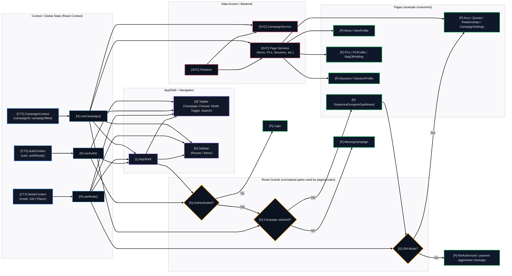
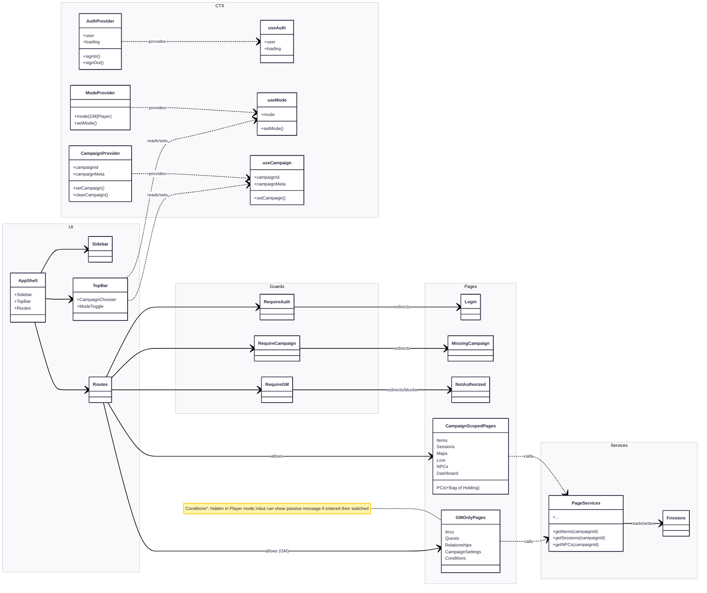

# Flowchart

```mermaid
---
config:
  theme: redux
  layout: dagre
---
flowchart LR

%% ======================
%% CONTEXT LAYER
%% ======================
subgraph CTX_LAYER["Context / Global State (React Context)"]
  direction TB

  AUTH_CTX["[CTX] AuthContext<br/>(user, authReady)"]
  MODE_CTX["[CTX] ModeContext<br/>(mode: GM | Player)"]
  CAMP_CTX["[CTX] CampaignContext<br/>(campaignId, campaignMeta)"]

  AUTH_H["[H] useAuth()"]
  MODE_H["[H] useMode()"]
  CAMP_H["[H] useCampaign()"]

  AUTH_CTX --> AUTH_H
  MODE_CTX --> MODE_H
  CAMP_CTX --> CAMP_H
end

%% ======================
%% APP SHELL / NAV
%% ======================
subgraph APP_LAYER["AppShell + Navigation"]
  direction TB

  APP["[L] AppShell"]
  TOP["[N] TopBar<br/>(Campaign Chooser, Mode Toggle, Search)"]
  SIDE["[N] Sidebar<br/>(Routes / Menu)"]

  APP --> TOP
  APP --> SIDE
end

%% ======================
%% ROUTE GATES (conceptual)
%% ======================
subgraph GATES["Route Guards (conceptual gates used by pages/routes)"]
  direction TB

  AUTH_GATE{"[G] Authenticated?"}
  CAMP_GATE{"[G] Campaign selected?"}
  GM_GATE{"[G] GM Mode?"}
end

%% ======================
%% DATA LAYER
%% ======================
subgraph DATA_LAYER["Data Access / Backend"]
  direction TB
  FS["[SVC] Firestore"]
  SVC_CAMPAIGN["[SVC] CampaignService"]
  SVC_PAGES["[SVC] Page Services<br/>(Items, PCs, Sessions, etc.)"]
  FS --> SVC_CAMPAIGN
  FS --> SVC_PAGES
end

%% ======================
%% PAGES (examples)
%% ======================
subgraph PAGES["Pages (example consumers)"]
  direction TB
  DASH["[P] DopamineDungeonDashboard"]
  ITEMS["[P] Items / ItemProfile"]
  PCS["[P] PCs / PCProfile / BagOfHolding"]
  SESS["[P] Sessions / SessionProfile"]
  GM_ONLY["[P] Arcs / Quests / Relationships / CampaignSettings"]
end

%% ======================
%% WIRING
%% ======================

%% AppShell consumes contexts for global UI
AUTH_H --> APP
MODE_H --> APP
CAMP_H --> APP

%% TopBar uses Mode + Campaign (chooser)
MODE_H --> TOP
CAMP_H --> TOP
AUTH_H --> TOP

%% Sidebar uses Mode to show/hide GM-only routes
MODE_H --> SIDE
CAMP_H --> SIDE

%% Gates use contexts conceptually
AUTH_H --> AUTH_GATE
CAMP_H --> CAMP_GATE
MODE_H --> GM_GATE

%% Typical routing sequence
APP --> AUTH_GATE
AUTH_GATE -- "No" --> LOGIN["[P] Login"]
AUTH_GATE -- "Yes" --> CAMP_GATE
CAMP_GATE -- "No" --> MISS["[P] MissingCampaign"]
CAMP_GATE -- "Yes" --> DASH

%% GM-only branch
DASH --> GM_GATE
GM_GATE -- "Yes" --> GM_ONLY
GM_GATE -- "No" --> NA["[P] NotAuthorized / passive-aggressive message"]

%% Data calls are campaign-scoped
CAMP_H --> SVC_CAMPAIGN
CAMP_H --> SVC_PAGES

SVC_PAGES --> ITEMS
SVC_PAGES --> PCS
SVC_PAGES --> SESS
SVC_PAGES --> GM_ONLY

%% Styling
classDef ctx fill:#111827,stroke:#60a5fa,stroke-width:2px,color:#e5e7eb;
classDef hook fill:#0b1220,stroke:#38bdf8,stroke-width:1px,color:#e5e7eb;
classDef nav fill:#111827,stroke:#a78bfa,stroke-width:2px,color:#e5e7eb;
classDef page fill:#0f172a,stroke:#22c55e,stroke-width:2px,color:#e5e7eb;
classDef gate fill:#0b1220,stroke:#f59e0b,stroke-width:2px,color:#e5e7eb;
classDef svc fill:#0b1220,stroke:#fb7185,stroke-width:2px,color:#e5e7eb;

class AUTH_CTX,MODE_CTX,CAMP_CTX ctx;
class AUTH_H,MODE_H,CAMP_H hook;
class APP,TOP,SIDE nav;
class DASH,ITEMS,PCS,SESS,GM_ONLY,LOGIN,MISS,NA page;
class AUTH_GATE,CAMP_GATE,GM_GATE gate;
class FS,SVC_CAMPAIGN,SVC_PAGES svc;
```

# Class chart

```mermaid
---
config:
  theme: redux
---
classDiagram
direction LR

%% =========================
%% NAMESPACES (grouping)
%% =========================

namespace CTX {
  class AuthProvider {
    +user
    +loading
    +signIn()
    +signOut()
  }

  class useAuth {
    +user
    +loading
  }

  class ModeProvider {
    +mode (GM|Player)
    +setMode()
  }

  class useMode {
    +mode
    +setMode()
  }

  class CampaignProvider {
    +campaignId
    +campaignMeta
    +setCampaign()
    +clearCampaign()
  }

  class useCampaign {
    +campaignId
    +campaignMeta
    +setCampaign()
  }
}

namespace UI {
  class AppShell {
    +Sidebar
    +TopBar
    +Routes
  }

  class Sidebar
  class TopBar {
    +CampaignChooser
    +ModeToggle
  }

  class Routes
}

namespace Guards {
  class RequireAuth
  class RequireCampaign
  class RequireGM
}

namespace Services {
  class PageServices {
    +getItems(campaignId)
    +getSessions(campaignId)
    +getNPCs(campaignId)
    +...
  }

  class Firestore
}

namespace Pages {
  class Login
  class MissingCampaign
  class NotAuthorized

  class CampaignScopedPages {
    Items
    Sessions
    Maps
    Lore
    NPCs
    PCs (+Bag of Holding)
    Dashboard
  }

  class GMOnlyPages {
    Arcs
    Quests
    Relationships
    CampaignSettings
    Conditions*
  }
}

%% =========================
%% RELATIONSHIPS (minimal + readable)
%% =========================

AuthProvider ..> useAuth : provides
ModeProvider ..> useMode : provides
CampaignProvider ..> useCampaign : provides

AppShell --> Sidebar
AppShell --> TopBar
AppShell --> Routes

TopBar ..> useMode : reads/sets
TopBar ..> useCampaign : reads/sets

Routes --> RequireAuth
Routes --> RequireCampaign
Routes --> RequireGM

RequireAuth --> Login : redirects
RequireCampaign --> MissingCampaign : redirects
RequireGM --> NotAuthorized : redirects/blocks

Routes --> CampaignScopedPages : allows
Routes --> GMOnlyPages : allows (GM)

CampaignScopedPages ..> PageServices : calls
GMOnlyPages ..> PageServices : calls
PageServices --> Firestore : reads/writes

%% Optional: note for special rule
note for GMOnlyPages "Conditions*: hidden in Player mode,\nbut can show passive message if entered then switched"
```