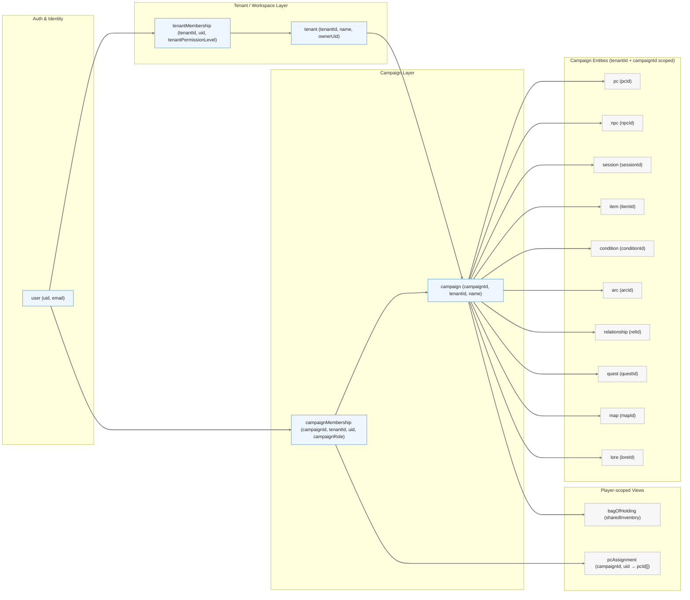

# 🗃️ Data Ownership Map (Firestore) — TO-BE

> Purpose: make **data scope, ownership, and write permissions** explicit and boringly clear.  
> This document is the guardrail against accidental privilege leaks and future refactor pain.

---

## Scope Definitions

| Scope | Meaning |
|-----|--------|
| **Global** | Shared across the entire app (avoid unless necessary) |
| **User-scoped** | Belongs to a single authenticated user |
| **Tenant-scoped** | Belongs to one workspace (Chinese wall boundary) |
| **Campaign-scoped** | Belongs to one campaign within a tenant (default for DD) |
| **PC-scoped** | Belongs to a character, always within a campaign |

---

## Logical Ownership & Access Model



---

## Firestore Persistence Layer (Physical Model)

This layer shows where data actually lives and how tenant isolation is enforced structurally.

```mermaid
---
config:
  layout: dagre
  nodeSpacing: 95
  rankSpacing: 150
---
flowchart LR

subgraph FS["Firestore Persistence Layer"]
direction TB

FS_USERS["users/{uid}"]:::fs

FS_TENANTS["tenants/{tenantId}"]:::fs
FS_TMEM["tenants/{tenantId}/members/{uid}"]:::fs

FS_CAMPS["tenants/{tenantId}/campaigns/{campaignId}"]:::fs
FS_CMEM["tenants/{tenantId}/campaigns/{campaignId}/members/{uid}"]:::fs

FS_PCS[".../pcs/{pcId}"]:::fs
FS_NPCS[".../npcs/{npcId}"]:::fs
FS_ITEMS[".../items/{itemId}"]:::fs
FS_SESS[".../sessions/{sessionId}"]:::fs
FS_MAPS[".../maps/{mapId}"]:::fs
FS_LORE[".../lore/{loreId}"]:::fs
FS_ARCS[".../arcs/{arcId}"]:::fs
FS_QUESTS[".../quests/{questId}"]:::fs
FS_RELS[".../relationships/{relId}"]:::fs
FS_COND[".../conditions/{condId}"]:::fs

FS_BOH[".../bagOfHolding"]:::fs

FS_USERS --> FS_TMEM
FS_TENANTS --> FS_CAMPS
FS_CAMPS --> FS_PCS
FS_CAMPS --> FS_ITEMS
FS_CAMPS --> FS_SESS
FS_CAMPS --> FS_MAPS
FS_CAMPS --> FS_LORE
FS_CAMPS --> FS_ARCS
FS_CAMPS --> FS_QUESTS
FS_CAMPS --> FS_RELS
FS_CAMPS --> FS_COND
FS_CAMPS --> FS_BOH

classDef fs fill:#f3fdf6,stroke:#4caf50,stroke-width:1.5px,color:#1b5e20;
linkStyle default stroke:#777,stroke-width:2.2px
```

**Hard rule:**
All Firestore queries must include tenantId (path-level isolation).
Cross-tenant reads are structurally impossible.

---

## Ownership & Permissions Matrix (Authoritative)

This table defines **where data lives**, **who owns it**, and **who may read/write it**.  
If something is unclear in code, **this table wins**.

| Domain | Firestore Location | Scope | Owner | Player Read | Player Write | GM Write | Notes |
|------|-------------------|-------|-------|-------------|--------------|----------|------|
| User profile | `users/{uid}` | User | System / User | n/a | prefs only | n/a | Auth identity & UI prefs |
| Tenant membership | `tenants/{tenantId}/members/{uid}` | Tenant | WorkspaceAdmin | read own | ❌ | ✅ | Workspace permission level |
| Campaign | `tenants/{tenantId}/campaigns/{campaignId}` | Campaign | GM | read | ❌ | ✅ | Top-level campaign metadata |
| Campaign members | `.../campaigns/{campaignId}/members/{uid}` | Campaign | GM | read own | ❌ | ✅ | Campaign role binding |
| Campaign settings | `.../campaigns/{campaignId}/settings` | Campaign | GM | ❌ | ❌ | ✅ | Rules, toggles, system config |
| PCs | `.../pcs/{pcId}` | Campaign + PC | GM | read assigned only | ❌ | ✅ | Player sees 1 PC or list |
| Bag of Holding | `.../bagOfHolding` | Campaign | Shared | read | ⚠️ limited | ✅ | Shared inventory |
| Items | `.../items/{itemId}` | Campaign | GM | read | ⚠️ assign-to-self | ✅ | Player never edits item |
| Lore | `.../lore/{loreId}` | Campaign | GM | read | ❌ | ✅ | Read-only for players |
| Maps | `.../maps/{mapId}` | Campaign | GM | read | ❌ | ✅ | Read-only |
| NPCs | `.../npcs/{npcId}` | Campaign | GM | read | ❌ | ✅ | Read-only |
| Sessions | `.../sessions/{sessionId}` | Campaign | GM | read | ❌ | ✅ | Read-only |
| Arcs | `.../arcs/{arcId}` | Campaign | GM | ❌ | ❌ | ✅ | GM-only |
| Quests | `.../quests/{questId}` | Campaign | GM | ❌ | ❌ | ✅ | GM-only |
| Relationships | `.../relationships/{relId}` | Campaign | GM | ❌ | ❌ | ✅ | GM-only |
| Conditions | `.../conditions/{condId}` | Campaign | GM | ⚠️ special | ❌ | ✅ | UX-restricted |

**Legend:**  
- ✅ allowed  
- ❌ blocked  
- ⚠️ limited / special-case behavior

---

## Write Paths (Explicit & Intentional)

This section defines **who can write what, from where, and why**.  
Any write path not listed here should be considered a bug.

---

### Player-Initiated Write Paths (Limited by Design)

Players are intentionally constrained. Their writes are **contextual actions**, not content creation.

#### Bag of Holding (Campaign-scoped)
- **Who**: Player
- **Where**: `/pcs` → *Bag of Holding tab*
- **Writes**:
  - add item to shared bag
  - (optional, TBD) add/remove currency
- **Constraints**:
  - cannot delete items added by GM
  - write may record metadata: `{ addedBy, addedAt }`

#### Items → Assign to Self
- **Who**: Player
- **Where**: `/items/:itemId`
- **Action**: “Assign to my character”
- **Effect**:
  - creates link between `itemId` and player’s assigned `pcId`
- **Important**:
  - player does **not** modify the Item document itself
  - assignment lives on the PC (or join document)

---

### GM-Initiated Write Paths (Authoritative)

GMs are the sole creators and editors of campaign content.

#### Campaign Structure
- create / edit:
  - Campaign
  - Campaign Settings
  - Arcs
  - Quests
  - Relationships
  - Conditions

#### World Content
- create / edit:
  - Items
  - Lore
  - Maps
  - NPCs
  - Sessions

#### Characters
- create PCs
- assign PCs to players (via campaign membership)
- edit PC data

#### Shared Inventory
- full control over Bag of Holding
- override player-added entries if needed

---

### Explicit Non-Write Areas (Players)

The following are **never writable** by players:
- Campaign Settings
- Narrative structures (Arcs, Quests, Relationships)
- NPCs
- Maps
- Lore
- Sessions
- Other players’ PCs

If a player can write here, **permissions are broken**.

---

## Open Decisions & Deferred Design Choices

These are **known unknowns**. They are intentionally deferred until after routing, permissions, and refactors are complete.

### Membership Model
**Decision pending:**
- flat collection  
  `campaignMemberships/{uid_campaignId}`
- OR nested  
  `users/{uid}/campaignMemberships/{campaignId}`

**Impacts:**
- permission checks
- campaign switching performance
- security rules complexity

---

### Item ↔ PC Assignment Model
**Options:**
- **Option A**: store `inventoryItemIds[]` on PC document
- **Option B**: join collection  
  `pcItems/{campaignId}/{pcId_itemId}`

**Trade-off:**
- Option A = simpler reads
- Option B = cleaner normalization & history

---

### Conditions Visibility Rules
Conditions currently have a **special-case UX rule**:
- hidden in Player mode
- visible if entered via GM, then switched
- show contextual message

**Decision pending:**
- GM-only forever
- partial read-only for players
- PC-scoped conditions only

---

### Currency Rules (Bag of Holding)
**Open questions:**
- Can players add currency?
- Can players remove currency?
- Is currency GM-only but items shared?

---

### Audit & History
**Future consideration:**
- write audit trail (`addedBy`, `editedBy`)
- especially for:
  - Bag of Holding
  - PC inventory
  - Conditions

Not required for MVP, but important for trust.

---

## Invariants

- Tenant boundaries are absolute
- Campaigns never cross tenants
- Roles grant permission; modes restrict behaviour
- UI hiding is never security
- A user’s identity never changes when switching mode
- All access is path-scoped by tenant