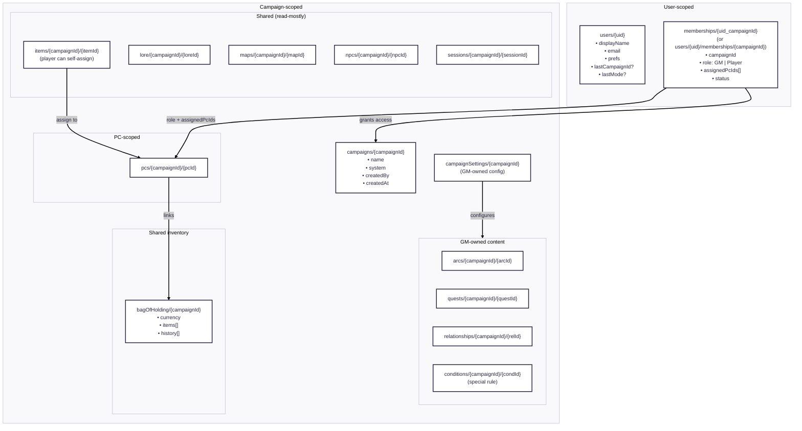

# 🗃️ Data Ownership Map (Firestore) — TO-BE

> Purpose: make **data scope, ownership, and write permissions** explicit and boringly clear.
> This document is the guardrail against accidental privilege leaks and future refactor pain.

---

## 0) Scope Definitions

| Scope | Meaning |
|-----|--------|
| **Global** | Shared across the entire app (avoid unless necessary) |
| **User-scoped** | Belongs to a single authenticated user |
| **Campaign-scoped** | Belongs to one campaign (default for DD) |
| **PC-scoped** | Belongs to a character, always within a campaign |

---

## 1) Ownership & Access Overview (Mermaid)

## 2) Ownership & Permissions Matrix (Authoritative)

This table defines **where data lives**, **who owns it**, and **who may read/write it**.
If something is unclear in code, this table wins.

| Domain | Firestore Location | Scope | Owner | Player Access | Player Write | GM Write | Notes |
|------|-------------------|-------|-------|---------------|--------------|----------|------|
| User profile | `users/{uid}` | User | System / User | n/a | limited (prefs) | n/a | Auth identity & UI prefs |
| Membership | `users/{uid}/memberships/{campaignId}` | User ↔ Campaign | GM/Admin | read own | ❌ | ✅ | Role, assigned PCs, status |
| Campaign | `campaigns/{campaignId}` | Campaign | GM/Admin | read | ❌ | ✅ | Top-level metadata |
| Campaign settings | `campaignSettings/{campaignId}` | Campaign | GM | ❌ | ❌ | ✅ | Rules, toggles, system config |
| PCs | `pcs/{campaignId}/{pcId}` | Campaign + PC | GM | read **assigned only** | ❌ | ✅ | Player sees 1 PC directly or list |
| Bag of Holding | `bagOfHolding/{campaignId}` | Campaign | Shared | read | ✅ (limited) | ✅ | Tab inside PCs section |
| Items | `items/{campaignId}/{itemId}` | Campaign | GM | read | ⚠️ assign-to-self | ✅ | Player cannot edit item |
| Lore | `lore/{campaignId}/{loreId}` | Campaign | GM | read | ❌ | ✅ | Read-only for players |
| Maps | `maps/{campaignId}/{mapId}` | Campaign | GM | read | ❌ | ✅ | Read-only |
| NPCs | `npcs/{campaignId}/{npcId}` | Campaign | GM | read | ❌ | ✅ | Read-only |
| Sessions | `sessions/{campaignId}/{sessionId}` | Campaign | GM | read | ❌ | ✅ | Read-only |
| Arcs | `arcs/{campaignId}/{arcId}` | Campaign | GM | ❌ | ❌ | ✅ | GM-only |
| Quests | `quests/{campaignId}/{questId}` | Campaign | GM | ❌ | ❌ | ✅ | GM-only |
| Relationships | `relationships/{campaignId}/{relId}` | Campaign | GM | ❌ | ❌ | ✅ | GM-only |
| Conditions | `conditions/{campaignId}/{condId}` | Campaign | GM | ⚠️ special | ❌ | ✅ | Hidden in Player mode unless entered via GM |

### Legend
- ✅ = allowed  
- ❌ = blocked  
- ⚠️ = limited / special-case behavior

## 3) Write Paths (Explicit & Intentional)

This section defines **who can write what, from where, and why**.
Any write path not listed here should be considered a bug.

---

### 3.1 Player-Initiated Write Paths (Limited by Design)

Players are intentionally constrained. Their writes are **contextual actions**, not content creation.

#### ✅ Bag of Holding (Campaign-scoped)
- **Who**: Player
- **Where**: `/pcs` → *Bag of Holding tab*
- **Writes**:
  - add item to shared bag
  - (optional, TBD) add/remove currency
- **Constraints**:
  - cannot delete items added by GM
  - write may record metadata: `{ addedBy, addedAt }`

#### ⚠️ Items → Assign to Self
- **Who**: Player
- **Where**: `/items/:itemId`
- **Action**: “Assign to my character”
- **Effect**:
  - creates link between `itemId` and player’s assigned `pcId`
- **Important**:
  - player does **not** modify the Item document itself
  - assignment lives on the PC (or join document)

---

### 3.2 GM-Initiated Write Paths (Authoritative)

GMs are the sole creators and editors of campaign content.

#### ✅ Campaign Structure
- create / edit:
  - Campaign
  - Campaign Settings
  - Arcs
  - Quests
  - Relationships
  - Conditions

#### ✅ World Content
- create / edit:
  - Items
  - Lore
  - Maps
  - NPCs
  - Sessions

#### ✅ Characters
- create PCs
- assign PCs to players (via Membership)
- edit PC data

#### ✅ Shared Inventory
- full control over Bag of Holding
- override player-added entries if needed

---

### 3.3 Explicit Non-Write Areas

The following are **never writable** by players:
- Campaign Settings
- Narrative structures (Arcs, Quests, Relationships)
- NPCs
- Maps
- Lore
- Sessions
- Other players’ PCs

If a player can write here, **permissions are broken**.

---

## 4) Open Decisions & Deferred Design Choices

These are **known unknowns**. They are intentionally deferred until after routing, permissions, and refactors are complete.

---

### 4.1 Membership Model
**Decision pending:**
- `memberships/{uid_campaignId}` (flat collection)
- OR `users/{uid}/memberships/{campaignId}` (nested)

**Impacts:**
- permission checks
- campaign switching performance
- security rules complexity

---

### 4.2 Item ↔ PC Assignment Model
**Options:**
- **Option A**: store `inventoryItemIds[]` on PC document
- **Option B**: join collection  
  `pcItems/{campaignId}/{pcId_itemId}`

**Trade-off:**
- Option A = simpler reads
- Option B = cleaner normalization & history

---

### 4.3 Conditions Visibility Rules
Conditions currently have a **special-case UX rule**:
- hidden in Player mode
- visible if entered via GM, then switched
- show passive-aggressive message

**Decision pending:**
- GM-only forever
- partial read-only for players
- PC-scoped conditions only

---

### 4.4 Currency Rules (Bag of Holding)
**Open questions:**
- Can players add currency?
- Can players remove currency?
- Is currency GM-only but items shared?

---

### 4.5 Audit & History
**Future consideration:**
- write audit trail (`addedBy`, `editedBy`)
- especially for:
  - Bag of Holding
  - PC inventory
  - Conditions

Not required for MVP, but important for trust.

---

> These decisions are **tracked, not blocking**.  
> They will be resolved after:
> - routing refactor
> - permission guards finalized
> - first real campaign usage