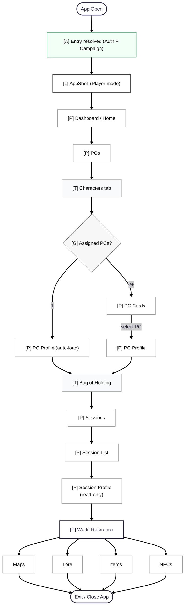
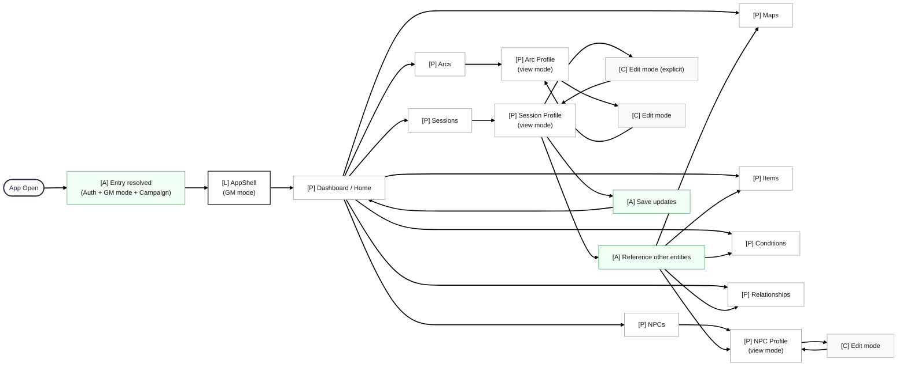

# User Flows

This document describes **all user journeys** in Dopamine Dungeon — both happy and unhappy paths.
Every flow begins with **App Open** and builds on shared system guarantees.

The foundational order is always:

**Authentication → Mode (GM / Player) → Campaign Context → App Shell → Route/Page**

---

## Flow 1 — App Open → Stable Entry

### Purpose
Establish a **stable, recoverable starting point** for every user, regardless of role, permissions, or campaign state.

This flow is the root of **all other flows** in the system.

---

### Actors
- Any user (GM or Player)

---

### System Guarantees After This Flow
After Flow 1 completes, the system guarantees:

- User identity is known (or explicitly not authenticated)
- User mode (GM / Player) is resolved
- Campaign context is either:
  - selected and valid, OR
  - explicitly missing/blocked with guidance
- UI is never partially rendered
- User always has a visible recovery action

---

### Happy Path — Authenticated, Campaign Selected

1. User opens the app.
2. Authentication state is resolved.
3. User is authenticated.
4. ModeContext resolves current mode:
   - GM or Player (based on role + last used mode).
5. CampaignContext resolves:
   - previously selected campaign exists and is accessible.
6. AppShell renders:
   - TopBar (with campaign selector & mode toggle)
   - Sidebar (pages filtered by mode)
7. Router loads default landing page:
   - Dashboard / Home (campaign-scoped).

Result:
- User is fully inside the app and can navigate freely within their permissions.

---

### Unhappy Path — Not Authenticated

1. User opens the app.
2. Authentication state resolves to **not authenticated**.
3. App renders **Login page only**.

Result:
- No AppShell
- No campaign context
- Clear CTA to authenticate

Recovery:
- After successful login, resume Flow 1 at Mode resolution.

---

### Unhappy Path — Authentication Loading / Delayed

1. User opens the app.
2. Authentication state is **loading**.
3. App renders **full-page loading state**.

Rules:
- No Login flicker
- No AppShell until auth resolves

Recovery:
- On resolve → continue Flow 1 normally.

---

### Unhappy Path — No Campaign Selected

1. User is authenticated.
2. ModeContext resolves successfully.
3. CampaignContext resolves to **no campaign selected**.
4. AppShell renders.
5. Main content shows **Campaign Required state**.

Result:
- Sidebar visible (navigation allowed but guarded)
- TopBar campaign selector highlighted
- Optional GM-only CTA: “Create campaign”

Recovery:
- User selects a campaign → continue to landing page.

---

### Unhappy Path — Campaign Missing or Access Denied

1. User is authenticated.
2. CampaignContext attempts to load last selected campaign.
3. Campaign does not exist OR user lacks access.
4. App renders **Campaign Access Error state**.

Result:
- AppShell remains visible
- Clear message explaining the issue
- Campaign selector available

Recovery:
- User selects another campaign
- System clears invalid campaign reference if needed

---

### Unhappy Path — Network / Backend Failure During Entry

Examples:
- Firestore unavailable
- Network offline
- Timeout during campaign fetch

1. User opens the app.
2. Authentication resolves (cached or online).
3. CampaignContext fails due to network error.
4. App shows **Non-destructive error state**.

Result:
- AppShell remains visible (if auth succeeded)
- Error banner or page-level error shown
- Retry action available

Recovery:
- Retry campaign fetch
- Continue flow once data is available

---

### Invariants Established by Flow 1

- AppShell is rendered **only after authentication**
- Campaign context is mandatory for meaningful interaction
- Users are never silently redirected
- Every blocked state includes:
  - explanation
  - visible recovery action

All subsequent flows assume these invariants.

### Flow 1 — App Open → Stable Entry (Diagram)

```mermaid
---
config:
  theme: redux
  layout: dagre
---
flowchart LR
  START(["App Open"]) --> AUTH_STATE{"[G] Auth state?"}

  %% --- Auth outcomes ---
  AUTH_STATE -- "Not authenticated" --> LOGIN["[P] Login"]
  AUTH_STATE -- "Authenticated" --> MODE_RESOLVE["[CTX] ModeContext</br>Resolve mode"]
  AUTH_STATE -- "Auth failed" --> AUTH_ERR["[P] AuthError</br>Retry / Re-login"]

  LOGIN -- "success" --> MODE_RESOLVE
  LOGIN -- "failure" --> AUTH_ERR
  AUTH_ERR -- "retry" --> AUTH_STATE

  %% --- Tenant boundary (future-friendly) ---
  MODE_RESOLVE --> TENANT{"[G] Tenant/Workspace resolved?</br>(TO-BE: orgId/tenantId)"}
  TENANT -- "Yes" --> CAMPS_LOAD["[CTX] CampaignContext</br>Load accessible campaigns"]
  TENANT -- "No / not applicable" --> CAMPS_LOAD

  %% --- Accessible campaigns only ---
  CAMPS_LOAD --> CAMPS_COUNT{"[G] Accessible campaigns count?"}

  CAMPS_COUNT -- "0" --> NO_CAMP["[P] NoCampaignAccess</br>Request invite / Create (GM)"]
  CAMPS_COUNT -- "1" --> AUTO_SELECT["[A] Auto-select only campaign"]
  CAMPS_COUNT -- "2+" --> PICKER["[P] CampaignPicker</br>(only accessible campaigns)"]

  AUTO_SELECT --> CAMPAIGN_READY["[CTX] Campaign selected"]
  PICKER -- "select campaign" --> CAMPAIGN_READY
  NO_CAMP -- "refresh/try again" --> CAMPS_LOAD

  %% --- Campaign validation + network errors ---
  CAMPAIGN_READY --> CAMP_OK{"[G] Campaign fetch OK?"}
  CAMP_OK -- "Yes" --> SHELL["[L] AppShell</br>TopBar + Sidebar"]
  CAMP_OK -- "Not found / access revoked" --> CAMP_ERR["[P] CampaignAccessError</br>Pick another"]
  CAMP_OK -- "Network/backend error" --> NET_ERR["[P] NetworkError</br>Retry (keep context)"]

  CAMP_ERR --> PICKER
  NET_ERR -- "retry" --> CAMP_OK

  %% --- Landing ---
  SHELL --> HOME["[P] Dashboard / Home (default)"]

  %% --- Styling (light) ---
  classDef gate fill:#f7f7f7,stroke:#666,stroke-width:1px,color:#111;
  classDef page fill:#ffffff,stroke:#999,stroke-width:1px,color:#111;
  classDef shell fill:#ffffff,stroke:#444,stroke-width:2px,color:#111;
  classDef err fill:#fff3f3,stroke:#cc6666,stroke-width:1px,color:#111;
  classDef ctx fill:#f8fbff,stroke:#6b8bbd,stroke-width:1px,color:#111;

  class AUTH_STATE,TENANT,CAMPS_COUNT,CAMP_OK gate;
  class LOGIN,AUTH_ERR,NO_CAMP,PICKER,CAMP_ERR,NET_ERR,HOME page;
  class SHELL shell;
  class MODE_RESOLVE,CAMPS_LOAD,CAMPAIGN_READY ctx;
  ```

---

#### Clarifications for your bullet points (so the diagram is “self-explaining”)

##### 1) “Auth failed” — what is it?
That’s when:
- Firebase/Auth provider errors out
- token refresh fails
- auth request returns an error
- user session is corrupted

We show **AuthError** with:
- Retry
- Re-login
- (optional) log-out cleanup

##### 2) What replaced “fallback/default” for mode?
Instead of “fallback/default” arrows, we made it explicit:

**ModeContext resolves mode**:
- if user has a stored `lastMode` → use it
- else derive from role:
  - GM → GM mode
  - Player → Player mode

So Mode resolve always succeeds unless the app is truly broken.

##### 3) Campaign list assumption fixed
We now have a proper split:
- **0 accessible campaigns** → NoCampaignAccess
- **1 accessible campaign** → Auto-select (no picker)
- **2+ campaigns** → CampaignPicker

##### 4) Picker shows only campaigns you can access
This is now baked in as a rule via:
> `Load accessible campaigns`

Meaning: the picker isn’t a “browse all campaigns” screen — it’s a “your campaigns” screen.

Same rule for GM: a GM sees only campaigns they’re a member/owner of.

---

#### About “commercial mode” / multi-tenant (“Chinese wall”)

You’re not crazy for thinking about this now — but we should **treat it as a requirement stub**, not a design rabbit hole.

##### What we do *now* (lightweight, correct)
We add one concept into requirements:

- **Tenant / Workspace boundary**
  - every campaign belongs to a tenant/workspace (`tenantId`)
  - every membership is scoped to tenant
  - campaign listing is filtered by tenant membership

This prevents:
- GM A seeing GM B’s campaigns
- cross-party leakage
- accidental “global admin” assumptions

##### When do we fully design it?
During **Architecture design / Data ownership map deep dive**, not during userflows.

So: **yes, we include a Tenant node in Flow #1 (done)**, and later we’ll formalize it in:
- Data model
- Security rules
- Query patterns

---

## Flow 2 — Campaign Selection & Switching (Diagram)

```mermaid
---
config:
  theme: redux
  layout: dagre
---
flowchart LR
  TRIGGER(["Campaign change triggered"]) --> LOAD["[CTX] CampaignContext</br>Load accessible campaigns"]

  LOAD --> COUNT{"[G] Accessible campaigns?"}

  COUNT -- "0" --> NO_ACCESS["[P] NoCampaignAccess</br>(request invite / create if GM)"]

  COUNT -- "1" --> AUTO["[A] Auto-select only campaign"]
  COUNT -- "2+" --> PICK["[P] CampaignPicker</br>(accessible only)"]

  PICK -- "select campaign" --> SELECTED["[CTX] Campaign selected"]
  AUTO --> SELECTED

  SELECTED --> VALID{"[G] Campaign valid & accessible?"}

  VALID -- "Yes" --> ROUTE_RESET["[A] Reset route</br>→ safe landing"]
  VALID -- "Access revoked / deleted" --> ACCESS_ERR["[P] CampaignAccessError</br>pick another"]
  VALID -- "Network error" --> NET_ERR["[P] NetworkError</br>retry"]

  ACCESS_ERR --> PICK
  NET_ERR -- "retry" --> VALID

  ROUTE_RESET --> HOME["[P] Dashboard / Home</br>(new campaign scope)"]

  %% Styling
  classDef gate fill:#f7f7f7,stroke:#666,stroke-width:1px,color:#111;
  classDef page fill:#ffffff,stroke:#999,stroke-width:1px,color:#111;
  classDef ctx fill:#f8fbff,stroke:#6b8bbd,stroke-width:1px,color:#111;

  class COUNT,VALID gate;
  class PICK,NO_ACCESS,ACCESS_ERR,NET_ERR,HOME page;
  class LOAD,SELECTED ctx;
  ```

---

### Key Rules (these matter later)

#### Campaign switching **never**
- preserves the current page blindly
- assumes permissions stay the same
- keeps edit state alive

#### Campaign switching **always**
- resets routing to a safe landing page
- re-evaluates permissions
- re-renders page content
- keeps AppShell mounted

---

### Unhappy / Edge Paths (Explicit)

#### Campaign deleted while user is inside it
- CampaignContext fails validation
- User is redirected into Flow 2 automatically
- CampaignAccessError is shown
- Picker opens (if alternatives exist)

---

#### Access revoked mid-session
- Same behavior as deletion
- No silent failures
- No stale data shown

---

#### Network failure during switch
- AppShell remains visible
- Current campaign context is **not destroyed**
- Retry does not force logout or reload

---

#### GM vs Player differences
- GM may see “Create campaign” CTA when count = 0
- Player never sees campaigns they don’t belong to
- Picker contents are always filtered by access

---

### Invariants Established by Flow 2
- CampaignContext is **the single source of truth**
- Route safety beats convenience
- No page owns campaign state
- Switching campaigns is reversible and recoverable

---

## Flow 3 — Route Access & Guarding

### Purpose
Define what happens when a user navigates to any route:
- via Sidebar
- via URL/deep link
- via refresh
- after switching mode (GM ↔ Player)
- after switching campaign

This flow ensures:
- no forbidden content leaks
- users always land somewhere safe
- errors are recoverable (not dead ends)

---

### Core Inputs (what guards decide with)
- **Auth state** (authenticated / not authenticated / failed)
- **Mode** (GM / Player)
- **CampaignContext** (selected / missing / invalid)
- **Membership** (user has access to this campaign)
- **Route policy** (GM-only / Player-allowed / read-only / hidden)
- **Entity access** (e.g., player’s assigned PC)

---

### Route Policies (TO-BE)
Routes declare their policy explicitly:

- **Public**: no auth required (Login only)
- **AuthOnly**: requires auth (Dashboard, etc.)
- **CampaignRequired**: requires selected campaign
- **GMOnly**: requires GM mode (and/or GM role)
- **PlayerScoped**: player may access only scoped entities (e.g., own PC)
- **ReadOnly**: allowed, but no mutation actions visible

> Note: “Hidden in Sidebar” is UI-only. Guards must still protect the URL.

---

### Flow 3 — Diagram

```mermaid
---
config:
  theme: redux
  layout: dagre
---
flowchart LR
  NAV(["User navigates to route"]) --> AUTH{"[G] Authenticated?"}

  AUTH -- "No" --> TO_LOGIN["[A] Redirect → /login"]
  AUTH -- "Auth failed" --> AUTH_ERR["[P] AuthError</br>Retry / Re-login"]
  AUTH -- "Yes" --> CAMP{"[G] Campaign required?"}

  %% Campaign requirement
  CAMP -- "No (Public/AuthOnly route)" --> POLICY
  CAMP -- "Yes" --> CAMP_SEL{"[G] Campaign selected?"}

  CAMP_SEL -- "No" --> CAMP_REQ["[P] CampaignRequired</br>Select campaign"]
  CAMP_SEL -- "Yes" --> CAMP_OK{"[G] Campaign accessible?"}

  CAMP_OK -- "No" --> CAMP_ERR["[P] CampaignAccessError</br>Pick another"]
  CAMP_OK -- "Yes" --> POLICY{"[G] Route policy check"}

  %% Route policy checks
  POLICY -- "GMOnly" --> GM{"[G] GM mode?"}
  GM -- "No" --> NA_GM["[P] NotAuthorized</br>(GM only)"]
  GM -- "Yes" --> ENTITY

  POLICY -- "PlayerAllowed / ReadOnly" --> ENTITY
  POLICY -- "PlayerScoped" --> SCOPE{"[G] Scoped access OK?</br>(e.g. assigned PC)"}
  SCOPE -- "No" --> NA_SCOPE["[P] NotAuthorized</br>(No assigned access)"]
  SCOPE -- "Yes" --> ENTITY

  %% Entity existence checks
  ENTITY{"[G] Entity exists?</br>(:id routes)"} -- "No" --> NOT_FOUND["[P] NotFound"]
  ENTITY -- "Yes / not applicable" --> RENDER["[P] Render route"]

  %% Recovery links (conceptual)
  NA_GM --> SAFE["[A] Go → Dashboard"]
  NA_SCOPE --> SAFE
  NOT_FOUND --> SAFE
  CAMP_REQ -->|select campaign| NAV
  CAMP_ERR -->|select campaign| NAV
  AUTH_ERR -->|retry| NAV
  SAFE --> NAV

  %% Styling
  classDef gate fill:#f7f7f7,stroke:#666,stroke-width:1px,color:#111;
  classDef page fill:#ffffff,stroke:#999,stroke-width:1px,color:#111;
  classDef act fill:#f2fff7,stroke:#55aa77,stroke-width:1px,color:#111;

  class AUTH,CAMP,CAMP_SEL,CAMP_OK,POLICY,GM,SCOPE,ENTITY gate;
  class AUTH_ERR,CAMP_REQ,CAMP_ERR,NA_GM,NA_SCOPE,NOT_FOUND,RENDER page;
  class TO_LOGIN,SAFE act;
```

### Unhappy Paths (Explicit Behaviours)

#### Player opens a GM-only page (URL or sidebar glitch)
- Route guard blocks access
- **NotAuthorized** page is shown with GM-only messaging
- Clear CTA provided: **“Go Home”** (Dashboard)

---

#### Player opens PCs page but has no assigned character
- If the route is **PlayerScoped**:
  - Access is blocked
  - **NotAuthorized** is shown
- If the PCs page itself is allowed:
  - **Characters** tab shows:
    - “No character assigned yet”
  - **Bag of Holding** tab remains accessible

---

#### User deep-links to an entity that doesn’t exist
- **NotFound** page is shown
- CTAs provided:
  - **“Go Home”**
  - **“Back to list”** (if applicable)

---

#### User switches to Player mode while on a GM-only route
- Route policy is re-evaluated immediately on mode change
- User is:
  - blocked with **NotAuthorized**, or
  - redirected to **Dashboard**
- No GM-only content remains visible or cached

---

#### Campaign missing or invalid during navigation
- Guard blocks navigation with:
  - **CampaignRequired**, or
  - **CampaignAccessError**
- Campaign picker remains reachable via **TopBar**
- User can recover without reload

---

#### Network failure during entity fetch
- **NetworkError** is shown (non-destructive)
- AppShell remains visible
- **Retry** action re-attempts the fetch
- Original route intent is preserved

---

### Invariants Established by Flow 3

- Route guards protect **URLs**, not just sidebar navigation
- UI hiding is **never** treated as a security mechanism
- Policy checks occur **before** entity fetching
- Forbidden content never flashes on screen
- Every blocked state includes a visible recovery action

---

## Flow 4 — Player Happy Path (Session Night)

### Purpose
Describe the ideal, low-friction experience for a **Player** during a game session.

This flow prioritizes:
- clarity over power
- reading over editing
- zero permission anxiety
- minimal navigation decisions

---

### Actor
- Player (authenticated, non-GM)

---

### Preconditions
- User is authenticated
- Player mode is active
- Campaign is selected and accessible
- Player is a member of the campaign

---

### Success Result
Player can:
- immediately see their character
- access shared party resources
- read session-related information
- exit without confusion or accidental changes

---

### Happy Path — Primary Flow

1. Player opens the app.
2. Authentication and campaign resolution complete (Flow 1).
3. AppShell renders with Player-filtered navigation.
4. Player lands on **Dashboard / Home**.

---

### Characters & Inventory

5. Player navigates to **PCs**.
6. PCs page loads in **Player view**.

#### Characters tab behaviour
- If player has **exactly one assigned character**:
  - Character profile loads automatically
  - No card selection required
- If player has **multiple assigned characters**:
  - Character cards are shown
  - Player selects one to view

7. Character profile is shown:
   - All fields are **read-only**
   - No edit actions are visible

#### Bag of Holding tab
8. Player switches to **Bag of Holding** tab.
9. Shared party inventory is displayed.
10. Player may:
    - view items
    - (optionally) assign items to themselves if allowed
11. No destructive actions are available.

---

### Session Awareness

12. Player navigates to **Sessions**.
13. Sessions list is displayed (read-only).
14. Player opens the **current or most recent session**.
15. Session details are shown:
    - notes
    - summary
    - outcomes
16. No editing or GM-only controls are visible.

---

### World Reference (Optional)

17. Player may navigate to:
    - **Maps**
    - **Lore**
    - **Items**
    - **NPCs**

18. All content is displayed in **read-only mode**.
19. Navigation between these pages does not change context or permissions.

---

### Exit

20. Player closes the app or navigates away.
21. No unsaved changes exist.
22. No confirmation dialogs are required.

---

### UX Principles Enforced by This Flow

- Player never wonders:
  - “Am I allowed to be here?”
  - “Can I break something?”
- Read-only is the default.
- The player’s own character is always easy to find.
- Shared resources are visible but safe.
- The system never exposes GM affordances accidentally.

---

### Recovery / Edge Behaviours (Still Happy)

- If assigned character is removed mid-session:
  - Characters tab updates
  - Message shown: “Your character is no longer assigned”
  - Bag of Holding remains accessible
- If network hiccup occurs:
  - AppShell remains visible
  - Retry banner appears
  - No loss of navigation context

### Flow 4 — Player Happy Path (Session Night) — Diagram


---

## Flow 5 — GM Happy Path (Prep + In-Session)

### Purpose
Describe the ideal experience for a **GM** preparing a session and running it live.

This flow prioritizes:
- fast scanning over deep editing
- intentional edits (no accidental changes)
- smooth switching between prep and play
- minimal UI friction during session time

---

### Actor
- GM (authenticated, GM mode active)

---

### Preconditions
- User is authenticated
- GM mode is active
- Campaign is selected and accessible

---

### Success Result
GM can:
- prepare content efficiently
- run a live session without UI friction
- update outcomes after the session
- never lose context or control

---

### Happy Path — Session Prep

1. GM opens the app.
2. Authentication, mode, and campaign resolve (Flows 1 & 2).
3. AppShell renders with GM navigation.
4. GM lands on **Dashboard / Home**.

5. GM navigates freely between:
   - **Sessions** (upcoming / past)
   - **NPCs**
   - **Arcs**
   - **Maps**
   - **Items**
   - **Conditions**
   - **Relationships**

6. GM opens relevant entities in **view mode by default**.
7. GM selectively enters **edit mode** where needed.
8. Changes are saved intentionally and locally scoped.

---

### Happy Path — In-Session Use

9. GM opens the **current Session**.
10. Session profile is visible:
    - notes
    - participants
    - outcomes
11. GM may:
    - reference NPCs
    - check Maps
    - inspect Conditions
    - review Relationships

12. GM switches between entities without losing session context.

---

### Happy Path — After Session

13. GM updates:
    - session summary
    - new conditions
    - item changes
    - relationship changes
14. GM saves changes.
15. GM exits session context.

---

### UX Principles Enforced by This Flow

- GM always starts in **view mode**
- Editing is explicit, never accidental
- Navigation is reference-first, not form-first
- No page reloads during session use
- Context (campaign + session) is never lost

---

### Calm Failure Handling (Still Happy)

- If a save fails:
  - error message shown inline
  - no data loss
- If network hiccup occurs:
  - AppShell remains visible
  - retry is available
- If GM switches mode accidentally:
  - Flow 3 rules apply immediately

---

### Flow 5 — GM Happy Path (Diagram)

